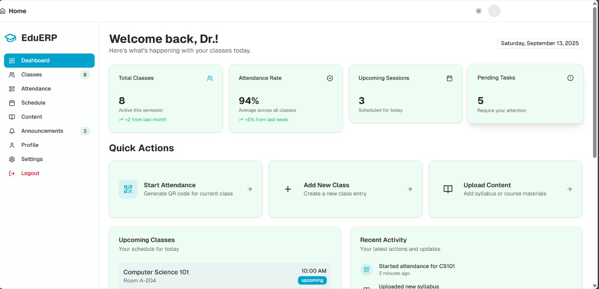
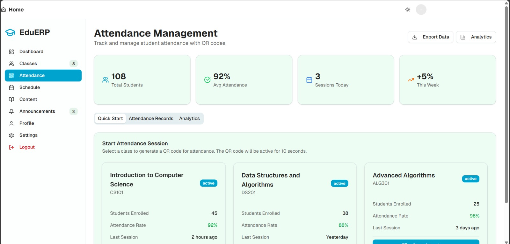
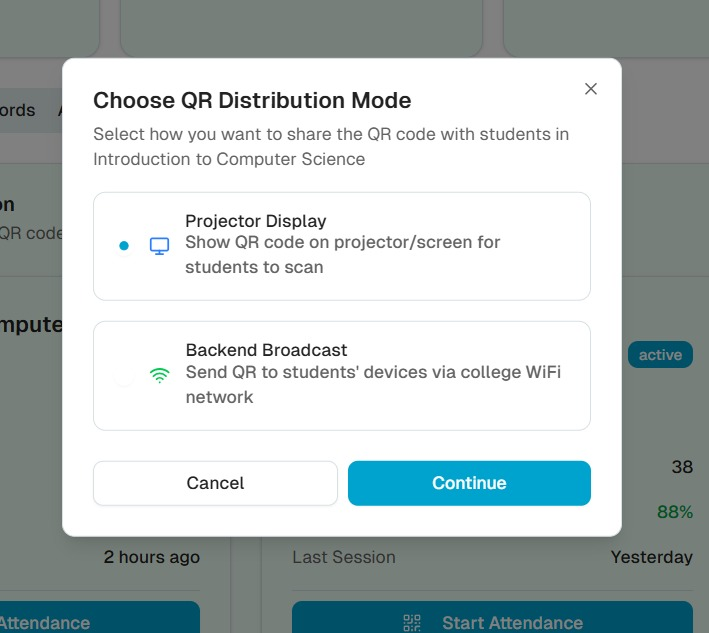
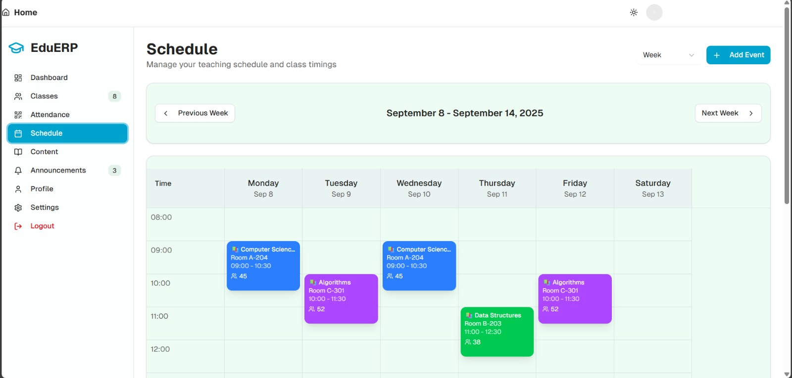
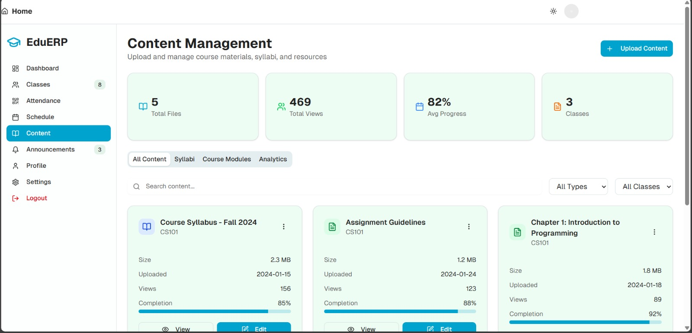
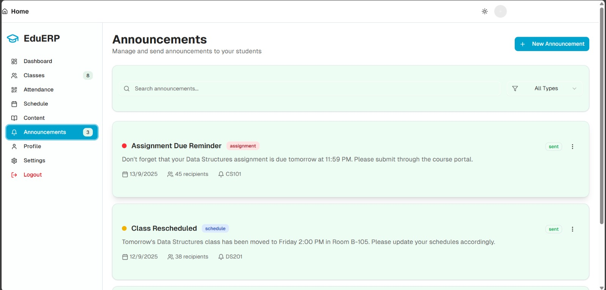

# EduERP Teacher Dashboard  

A **Next.js-based web dashboard** designed for teachers to simplify classroom management, automate attendance, manage schedules, upload content, and make announcements seamlessly. This project is part of a larger ecosystem that integrates with a **mobile student application**, aiming to revolutionize the education field with **automation, productivity, and personalized learning**.  

---

## 🚨 Problem Statement  

Many educational institutions still rely on **manual attendance systems** that are time-consuming and error-prone. Teachers lose valuable instructional time, and students often waste free periods due to poor structure and lack of guidance. Current systems lack proper integration between **daily schedules, content management, attendance tracking, and personalized student planning**.  

---

## 🎯 Vision  

This project is being built out of passion for **innovation in education technology**, with the goal of making a **revolutionary step** towards:  

- Saving teachers’ valuable time.  
- Automating repetitive tasks like attendance.  
- Providing structured academic flow for students.  
- Building an ecosystem that supports **both teachers and students** in a meaningful way.  

---

## ✨ Features  

### 👩‍🏫 Teacher Dashboard  
- **Attendance Management**  
  - Generate **QR codes** for attendance.  
  - Two distribution methods:  
    1. **Projector Display** – Show QR code on screen.  
    2. **WiFi Broadcast** – Send QR only to students connected to the classroom WiFi.  
  - Real-time analytics of attendance rate.  

- **Class Scheduling**  
  - View weekly calendar of classes.  
  - Add and manage lecture timings.  

- **Content Management**  
  - Upload and organize syllabi, assignments, and course materials.  
  - Track **student engagement** with views and completion percentage.  

- **Announcements**  
  - Send reminders, assignment deadlines, and rescheduled class updates.  
  - Delivered directly to the **student mobile app** via backend integration.  

- **Assignments**  
  - Teachers can upload assignments with due dates.  
  - Students receive notifications via their app.  

---

## 🛠️ Tech Stack  

- **Frontend:** [Next.js](https://nextjs.org/), React, TailwindCSS  
- **Backend Integration:** Node.js + Express (for announcements & attendance sync)  
- **Database:** MongoDB / PostgreSQL (configurable)  
- **Authentication:** NextAuth.js (planned)  
- **Deployment:** Vercel / Docker  

---

## 📸 Dashboard Screenshots  

| Dashboard | Attendance | QR Distribution |  
|-----------|------------|-----------------|  
|  |  |  |  

| Schedule | Content | Announcements |  
|----------|---------|---------------|  
|  |  |  |  

---

## 🚀 Getting Started  

### Prerequisites  
- Node.js (>=18.x)  
- npm or yarn  

### Installation  

``bash
# Clone the repository
git clone https://github.com/your-username/teacher-dashboard.git

# Navigate into the project
cd teacher-dashboard

# Install dependencies
npm install

# Start the development server
npm run dev

``
Project Structure
php
Copy code
├── components/     # Reusable UI components
├── pages/          # Next.js pages (Dashboard, Attendance, Schedule, etc.)
├── public/         # Static assets
├── screenshots/    # Project screenshots for README
├── styles/         # TailwindCSS styling
├── utils/          # Helper functions
└── README.md
📱 Mobile App (Coming Soon)
The student-side mobile application (separate repository) will provide:

Attendance confirmation.

Daily/weekly schedules.

Assignment submissions.

Personalized guidance during free slots.

🤝 Contribution
Contributions are welcome! If you’d like to collaborate:

Fork this repo.

Create a new branch (feature/your-feature).

Commit your changes.

Open a Pull Request.

📌 Roadmap
 Attendance with QR code distribution.

 Class scheduling and calendar.

 Content management & analytics.

 Announcements system.

 Authentication & Role-based access.

 Integration with student app.

 AI-based personalized study suggestions.

💡 Motivation
This project is a passion-driven initiative to reshape education by introducing automation and structure into everyday teaching. By bridging the gap between teachers’ tasks and students’ needs, this platform aims to create a more productive, guided, and innovative learning environment.

📜 License
This project is licensed under the MIT License – feel free to use and modify it.
---
